# MeetupAPI

* This is a project about add/update/delete meetups API
* There are several branches on that repo, each one has a small project

## Database

* As a part of `create-database.sql` script running as a part of docker image, it adds Roles automatically to the 
database with values:

```
INSERT INTO 
[MeetupDb].[dbo].[Roles]
VALUES ('User'),('Moderator'),('Admin')
```

## Enabling Central Package Management

Considering that the solution has several projects, it is easier to have a Central Package Management.
`Directory.Packages.props` file was created first and to move all packages that are used in solution,
the tool [directory-packages-props-converter](https://github.com/Vannevelj/directory-packages-props-converter).
In order to run it on the current solution, place it to the root folder and run a command:

```
directory-packages-props-converter-windows-amd64.exe .
```

After that you could find a new generated file `Directory.Packages.props` with all Nuget Packages and their current
versions.
Every time you add or update a Nuget package, it will happen in one place `Directory.Packages.props`.
The other projects would have only a package names included in them, e.g.:

```
    <PackageReference Include="Microsoft.Data.SqlClient" />
    <PackageReference Include="Microsoft.EntityFrameworkCore" />
    <PackageReference Include="Microsoft.EntityFrameworkCore.SqlServer" />
    <PackageReference Include="Microsoft.EntityFrameworkCore.Tools">
```

[Microsoft Central Package Management](https://learn.microsoft.com/en-us/nuget/consume-packages/central-package-management)

## Swagger

* Swagger documentation is set up and could be accessed using url `https://localhost:5001/swagger/index.html`
* The open api docs generate as a PostBuildEvent

First, set this two settings to `true` in `MeetupAPI.csproj`

```
    <GenerateDocumentationFile>true</GenerateDocumentationFile>
    <GenerateSwaggerFiles>true</GenerateSwaggerFiles>
```

Then add a folder where we will generate docs and sdk client.
Then add command in the same csproj file:

```
  <Target Name="SwaggerPostBuildTarget" AfterTargets="PostBuildEvent">
    <Exec Command="dotnet tool restore"></Exec>
    <Exec Command="dotnet swagger tofile --yaml --output docs/api.yaml $(TargetPath) v1" />
  </Target>
```

More info on [gitHub page](https://github.com/domaindrivendev/Swashbuckle.AspNetCore#swashbuckleaspnetcorecli)

Also, both Nuget Packages needs to be installed:


In the folder with `MeetupAPI.csproj`, run a command:

```
>dotnet new tool-manifest
The template "Dotnet local tool manifest file" was created successfully.
```

It creates `\.config\dotnet-tools.json` file with settings:

```
{
  "version": 1,
  "isRoot": true,
  "tools": {
    "swashbuckle.aspnetcore.cli": {
      "version": "6.6.2",
      "commands": [
        "swagger"
      ],
      "rollForward": false
    }
  }
}
```

The command `dotnet tool restore` was still failing with an exception:
`dotnet tool restore cannot find the local manifest file`
There was a solution on the issue page [github issue](https://github.com/dotnet/sdk/issues/33921)

```
dotnet tool install Cake.Tool --version 3.1.0
```

It added more settings to `\.config\dotnet-tools.json` and the build was successfull.
To add sdk client generated by `NSwag`, add command to `MeetupAPI.csproj`:

```
  <Target Name="NSwag" AfterTargets="AfterBuild" Condition=" '$(GenerateSwaggerFiles)' == 'true'">
    <Exec Command="$(NSwagExe_Net60) openapi2csclient /input:docs/api.yaml /output:docs/MeetupClient.cs /JsonLibrary:SystemTextJson /classname:{controller}Client /operationGenerationMode:MultipleClientsFromFirstTagAndPathSegments /generateOptionalParameters:true /wrapResponses:true /generateResponseClasses:true /responseClass:Response /exceptionClass:MeetupApiException /useBaseUrl:false /generateClientInterfaces:true /generateOptionalPropertiesAsNullable:true" />
  </Target>
  ```

* You need to specify output and input folders correctly (from the current folder)
* There is no support higher than .NET 6 but you still can use this command with .NET 7 and higher
* `generateOptionalPropertiesAsNullable:true` – that was a bug fix for the client
* Autogenerated `MeetupClient.cs` can be used for integration tests and so on.

## Postman Collection

All available endpoints you might find in `dev-tools`, they stored as a Postman collection.

## Branches

* `ef-sp-migration` this is an example how to add stored procedures to your EF Migrations
  There is a good [artical](https://clearmeasure.com/creating-stored-procs-in-ef-migrations/) to achieve that in your
  progect
  Steps to add the migration:

1. Use the standard command

```
dotnet ef migrations add StoredProcs
```

2. Add the code to read `.sql` files and apply sql code to the `migrationBuilder` in the Up method
3. Make sure the `.sql` files are added as embedded resources
4. Update your database

```
dotnet ef database update
```

* `exception-without-throwing` it is another small project (ongoing) where instead of throwing exceptions,
  we would hadle bad state with ResultType (monadic transformations in C#).
  This is [Original idea](https://www.youtube.com/watch?app=desktop&v=a1ye9eGTB98).
* `load-testing` branch includes 5 files with tests for API performance written using k6 tool (Grafana Labs):

1. `load_test.js`
2. `sample_test.js`
3. `soak_test.js`
4. `spike_test.js`
5. `stress_test.js`

There is a [link](https://k6.io/docs/get-started/installation/) how to install k6

1. Install the tool on your PC
2. Run the test with providing the file name, e.g.:

```
k6 run sample_test.js
```

The tool has a nice UI, there is a clear picture in a console window:
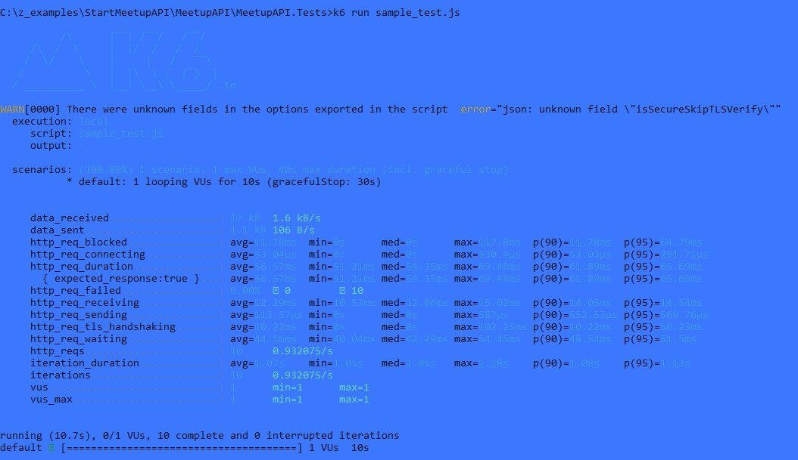

* `minimal-api` - this branch holds implementation of Miniumal API using FastEndpoints.

The project file could be found in `MeetupAPI.MinimalApi` folder. Swagger documentation is set up and could be accessed
using url `https://localhost:5000/swagger/index.html`.

* `started-with-mediatr` - this branch shows how to migrate to MediatR and use handlers, separating the project into
  vertical slices. If the functionality is just like that it might not have a lot of value. But with MediatR there are
  some interesting features become available where
  we can set up behavior, and emit events using MediatR build-in functionality. To be continued...

* `ardalis-apiEndpoint` - this branch to try out Ardalis
  ApiEndpoint [gitHub link](https://github.com/ardalis/ApiEndpoints) that we can use to rewrite MVC endpoints to
  suggested templates.
  The change is easy to apply and solution looks much cleaner. That's how it is in Swagger:
  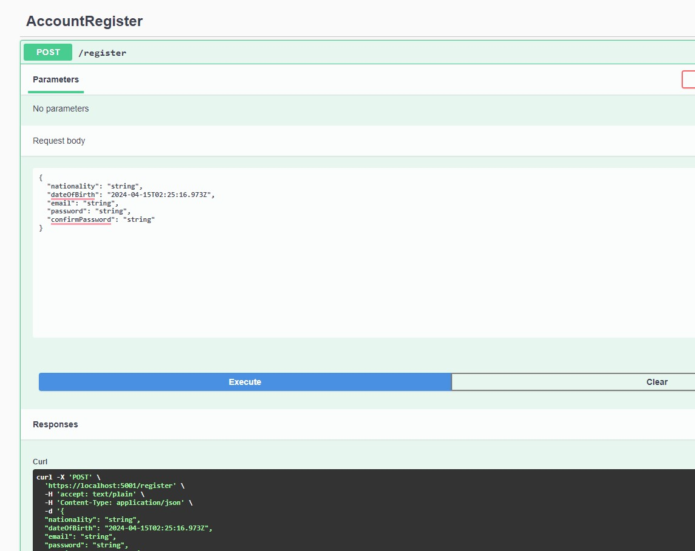

* `integration-tests-custom` - this branch is about setting up integration tests using a custom setup instead of
  standard and heavy
  `WebApplicationFactory` - [Original link](https://wrapt.dev/blog/integration-tests-in-dotnet-without-webappfactory).
  There is still a problem with the `TestingServiceScope` class, but the whole idea is quite clear.
* `senrty-feature` - this branch is to explore [Sentry.io] functionality, site [Sentry.io](https://sentry.io/) site and create an account. For the specific project choose what platform and language you use:
  To obtain a secret key go to:
  * Setting (a cog next to the project name)
  * Client Keys (DSN)
  * Default DSN
Their traces look like: 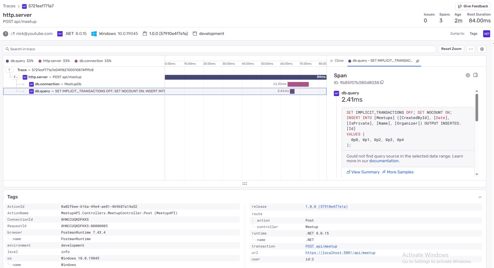
Adding config to the api:
```
    builder.WebHost.UseSentry(options =>
    {
        options.Dsn = builder.Configuration.GetSection("Sentry:Dsn").Get<string>();
        options.SendDefaultPii = true;
        options.SampleRate = 1.0f;
        options.TracesSampleRate = 1.0;
        options.UseOpenTelemetry();
    });
    //Also setting should be set in .AddOpenTelemetry
    //***********************************************
    builder.Services.AddOpenTelemetry()
    .WithMetrics(x =>
    {
        ****
    })
    .WithTracing(x =>
    {
        if (builder.Environment.IsDevelopment()) x.SetSampler<AlwaysOnSampler>();

        x.AddAspNetCoreInstrumentation()
            .AddGrpcClientInstrumentation()
            .AddHttpClientInstrumentation()
            .AddSentry();
    });
```
## Dockerization

* The original idea was found on
  github, [Mssql-docker-initialization-demo](https://github.com/tometchy/Mssql-docker-initialization-demo):

Find out more details in the [article](https://www.softwaredeveloper.blog/initialize-mssql-in-docker-container).

To build an image on your machine:

```
docker build -t db-meetup . --no-cache
``` 

`--no-cache` is especially useful when the image has already existed on your machine and you need to update it with new
changes.

Then, run the container:

```
docker run --name <container_name> -p 14033:1433 -d db-meetup
```

Next, you can establish a connection to the SQL Server using SQL Server Management Studio (SSMS). When doing so from
your local machine, enter `localhost,14033` as the Server name. Opt for SQL Server Authentication and input the "sa"
user along with the corresponding password specified in the Dockerfile.

## Aspire

The new feature of .NET 8 was introduced using Visual Studio tools to add default projects `Meetup.Aspire.AppHost` and
`Meetup.Aspire.ServiceDefaults` to run Aspire succesfully.
To run Aspire, you would need to run specifically `Meetup.Aspire.AppHost`:
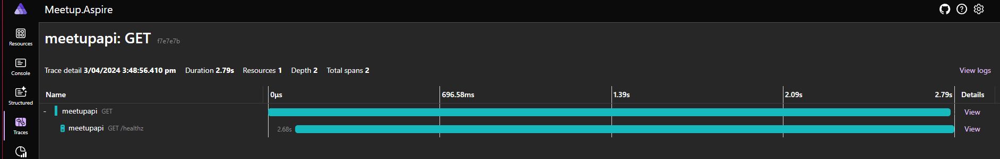
There are resources, metrics, traces (see the picture above), and logs and they all are preset and customisable for
particular needs in your application.
First step is to install Aspire Tooling:
```
 dotnet workload install aspire
```
Aspire `Meetup.Aspire.AppHost.csproj` should look like:
```
<Project Sdk="Microsoft.NET.Sdk">
  
  <Sdk Name="Aspire.AppHost.Sdk" Version="9.2.0" />

</Project>
```
Also, it is possible to generate `manifest.json` file describing everything that is happening in your applications and
how Aspire wires everything up. Then this file might be taken and translated to any cloud environment, IaC that is
required. This command creates a manifest file:

```
dotnet run --publisher manifest --output-path manifest.json
```

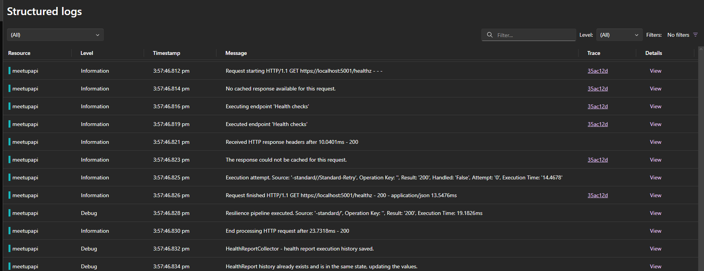

There is a command to create a docker compose file using aspirate library (it is in prerelease now):

```
aspirate generate --output-format compose
```

## Health Checks

* There is a good [article](https://rmauro.dev/adding-health-checks-ui/) how to set up UI client for a health check.
* Meetup project needs to be sure that db connection is up and running correctly.
* To make a call to health check,

```
https://localhost:5001/healthz
```

Then, you would see a more detailed response compare to a very standard one:

```
{
  "status": "Healthy",
  "totalDuration": "00:00:00.0037176",
  "entries": {
    "Database": {
      "data": { },
      "duration": "00:00:00.0024150",
      "status": "Healthy",
      "tags": [ ]
    }
  }
}
```

* If you prefer to access the Health Check UI, there is a link for that:

```
https://localhost:5001/healthchecks-ui#/healthchecks
```

The Health Check UI page looks like that:
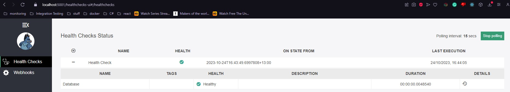

* Polling time between check is set to 15 seconds
* 60 entries is maximum history of checks
* API requests concurrency is set to 1

## Unit tests

#### Summary

The `UpdateUserValidatorTests` class contains unit tests for the `UpdateUserValidator` class. It tests the validation
logic for the `RoleId` and `Email` properties of the `UpdateUserDto` class.

#### Example Usage

```csharp
// Arrange
var validator = new UpdateUserValidator(meetupContext);
var updateUserDto = new UpdateUserDto { RoleId = 111 }; // Assuming 111 is an invalid RoleId

// Act
var result = validator.TestValidate(updateUserDto);

// Assert
result.ShouldHaveValidationErrorFor(x => x.RoleId)
    .WithErrorMessage("Role doesn't exist");
```

### Code Analysis

#### Main functionalities

- The `ShouldHaveValidationError_WhenRoleIdDoesNotExist` method tests if a validation error is thrown when the `RoleId`
  property of the `UpdateUserDto` object does not exist in the database.
- The `ShouldHaveValidationError_WhenEmailDoesNotExist` method tests if a validation error is thrown when the `Email`
  property of the `UpdateUserDto` object does not exist in the database.
- The `ShouldNotHaveValidationError_WhenRoleIdAndEmailExist` method tests if no validation error is thrown when both the
  `RoleId` and `Email` properties of the `UpdateUserDto` object exist in the database.

___

#### Methods

- `ShouldHaveValidationError_WhenRoleIdDoesNotExist`: This method tests if a validation error is thrown when the
  `RoleId` property of the `UpdateUserDto` object does not exist in the database. It creates an instance of the
  `UpdateUserValidator` class, sets an invalid `RoleId` in the `UpdateUserDto` object, and validates it using the
  `TestValidate` method. It then asserts that a validation error is returned with the expected error message.
- `ShouldHaveValidationError_WhenEmailDoesNotExist`: This method tests if a validation error is thrown when the `Email`
  property of the `UpdateUserDto` object does not exist in the database. It follows a similar approach as the previous
  method, but sets an invalid email address in the `UpdateUserDto` object.
- `ShouldNotHaveValidationError_WhenRoleIdAndEmailExist`: This method tests if no validation error is thrown when both
  the `RoleId` and `Email` properties of the `UpdateUserDto` object exist in the database. It follows a similar approach
  as the previous methods, but sets valid values for both properties.

___

### Environments

#### Fields

- `_fixture`: An instance of the `DatabaseFixture` class used for setting up the database context.
- `meetupContext`: The `MeetupContext` object used for database operations.

___

#### Custom Fact Attribute

`CustomFactAttribute` could mark a test that needs to be skipped on as particular environment. E.g. test
`Create_ReturnsCreated_WhenLectureCreated` would be skipped on a `staging` env as it is marked by `CustomFactAttribute`.

#### Kubernetes Deployment YAML File

`deployment.yaml` was added as an example. More info on:
[kubernetes-deployment-yaml](https://spacelift.io/blog/kubernetes-deployment-yaml)

### Aspire Dashboard

Using Open Telemetry for local development that shows all basic metrics and logging on Aspire dashboard. There is no
need even to set up Aspire itself. We would need only a dashboard and it will run in a docker container as a standalone
app. There are a couple of custom metrics introduced in the code in `MeetupApiMetrics` class on top of built-in metrics.
`MeetupApiMetrics` has an implementation of counting how many times the API call was done (set on POST for
`MeetupController`) and how long in ms that request lasts.
To introduce dashboard all we need to run the docker command:

```
docker run --rm -it -p 18888:18888 -p 4317:18889 -d --name aspire-dashboard mcr.microsoft.com/dotnet/nightly/aspire-dashboard:8.0.0-preview.6
```

- port 18888 is for the dashboard
- port 4317 is for the exporter
- use aspire-dashboard docker image
  Url is shown in docker and got to `http://localhost:18888`
  As it is still under preview you will need a token to log in:
  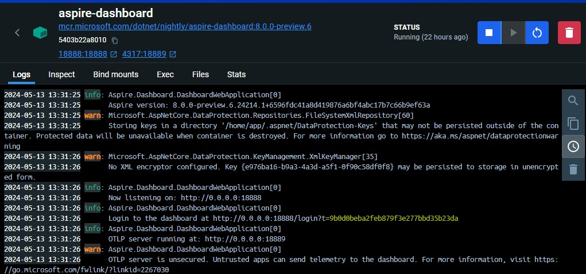
  This token is passed to log into the aspire dashboard.
  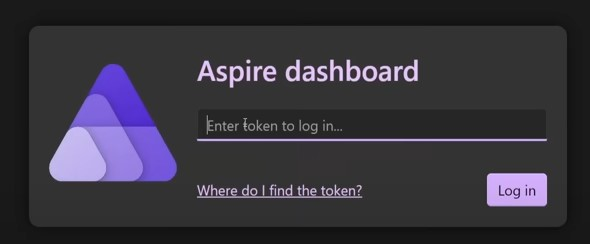
  There are different things you can see there:
- Structure logs with traceparent
  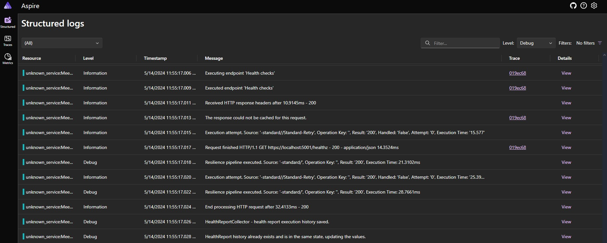
- Traces to see all requests with durations and information about it
  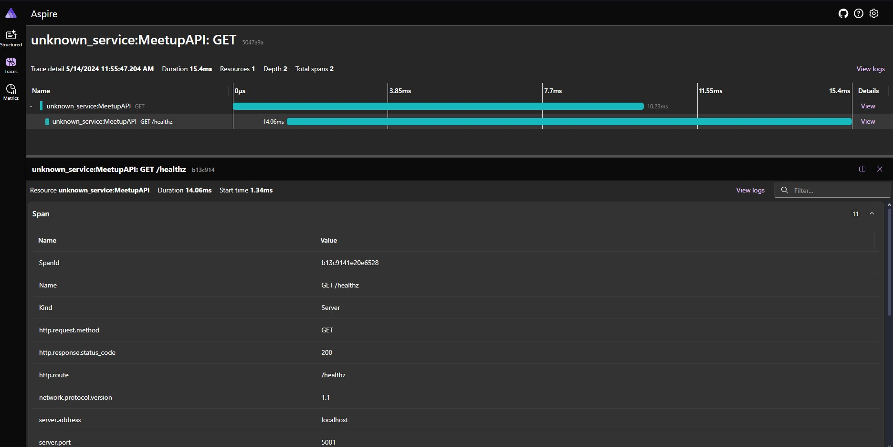
- And mertics with count and duration
  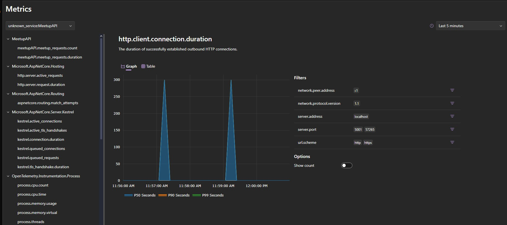
  The dashboard does not store any data if you concern about security.

#### Additional settings

You might change some settings in `launchSettings`

- Set `OTEL_EXPORTER_OTLP_ENDPOINT` and use another endpoint to export your settings
- `OTEL_METRIC_EXPORT_INTERVAL` set to 10 seconds (10000). For the great demo to see changes immediately it could be set
  to 1 second (1000)

[Original idea](https://www.youtube.com/watch?v=617oVraGY_M&t=1s)

#### Autogenerated Code
There is a number of libraries that use auto code generation to create classes for their functionality, e.g. mappers:


#### Static factory to emit domain events
[Original idea](https://github.com/ardalis/Ardalis.SharedKernel/tree/main/src/Ardalis.SharedKernel) and
[DomainEventsInterceptor](https://github.com/ardalis/AggregateStaticFactoryMethods/blob/main/DomainEventsInterceptor.cs)
